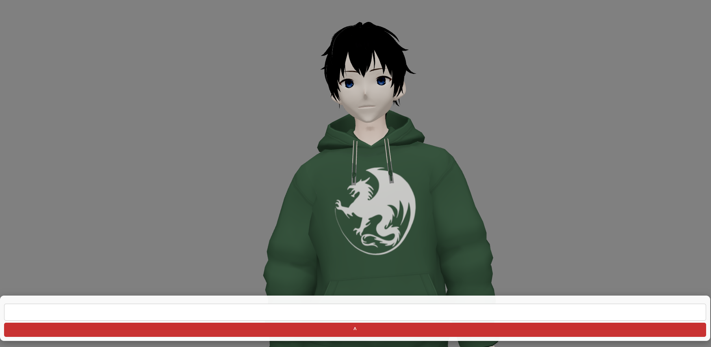
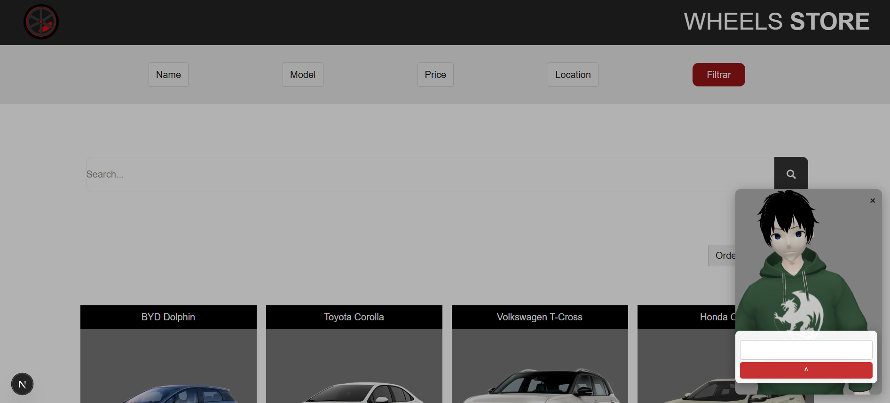

# Chatbot de atendimento

Vídeo demonstrativo 
https://www.youtube.com/watch?v=3sfqZjgSE-M



O chatbot consegue interagir em tempo real, trazendo respostas praticas sobre dúvidas relacionadas ao seu assunto de preferência.



O chat-bot pode ser integrado a qualquer pagina web, facilitando sua implementação.

## Tecnologias utilizadas
React
Three.js
FastAPI
Bart-large-mnli - zero-shot-classification

## Fazer Setup 
Para rodar a api localmente, execute os seguintes comandos dentro da Pasta nlpModel
```bash
pip install -r requirements.txt

uvicorn app.main:app --reload --host 0.0.0.0 --port 8000
```

Para rodar localmente o front-end, execute os seguintes comandos dentro da pasta front-end
```bash
npm install

npm run dev
```

A API ficara localizada em http://localhost:8000
O chatbot ficará acessível em http://localhost:3000

### Setup com docker
Primeiro, instale [Docker](https://docs.docker.com/get-started/get-docker/) e [Docker Compose](https://docs.docker.com/compose/install/)

Então, na pasta raíz do projeto, execute o seguinte comando

```bash
docker-compose up --build
```